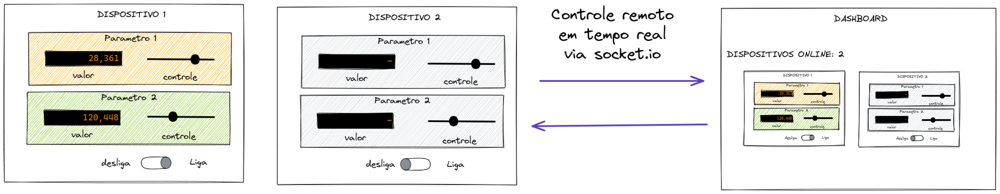
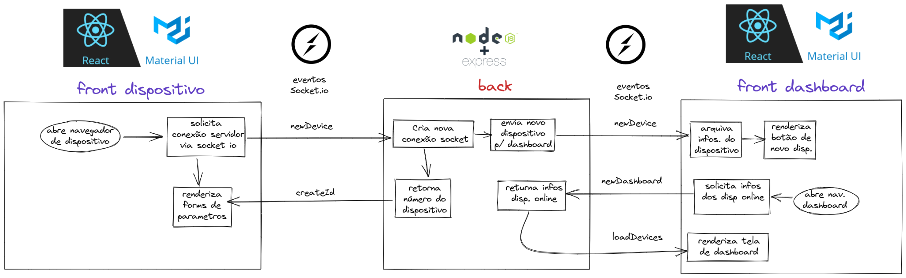
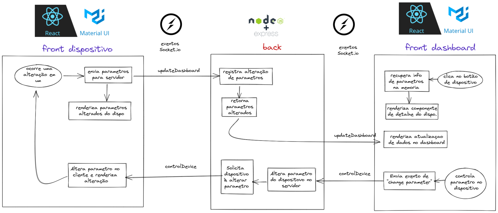
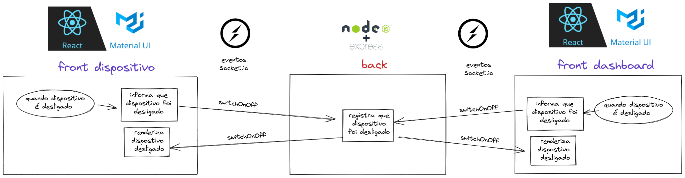

# Bem vindos ao projeto de demostração de tecnologia de conexão em tempo real

## Descrição do projeto

Trata-se de uma simulação de coneção entre dispositivos (que poderiam ser IoTs) e um dashboard de controle central.

Os comandos e leituras dos dispositivos são atualizados em tempo real e o dashboard tem acesso plano a todos os controles dos dispositivos 

## Fluxos de funcionamento

O projeto apresenta 3 fluxos princiais

### Fluxo de conexão de um dispositivo

É acionado quando um disposito é "ligado" e estabelece uma conexão com o servidor

### Fluxo de atualização do dashboard e controle remoto de dispositivo

É acionado quando ocorre alguma alteração no dispositivo ou quando o dashboard comanda alguma alteração

### Fluxo de ligar e desligar um dispositivo

É acionado quando o dispositivo ou o dashboard acionam o botão de desligar

## Teste!

O funcionamento do projeto pode ser visto no link a baixo:

https://desafio-tecnico-senai-frontend.herokuapp.com/

## Backend

O repositório do servidor socket.io pode ser acessado no link:

https://github.com/rogerio-lambert/desafio-tecnico-senai-backend
